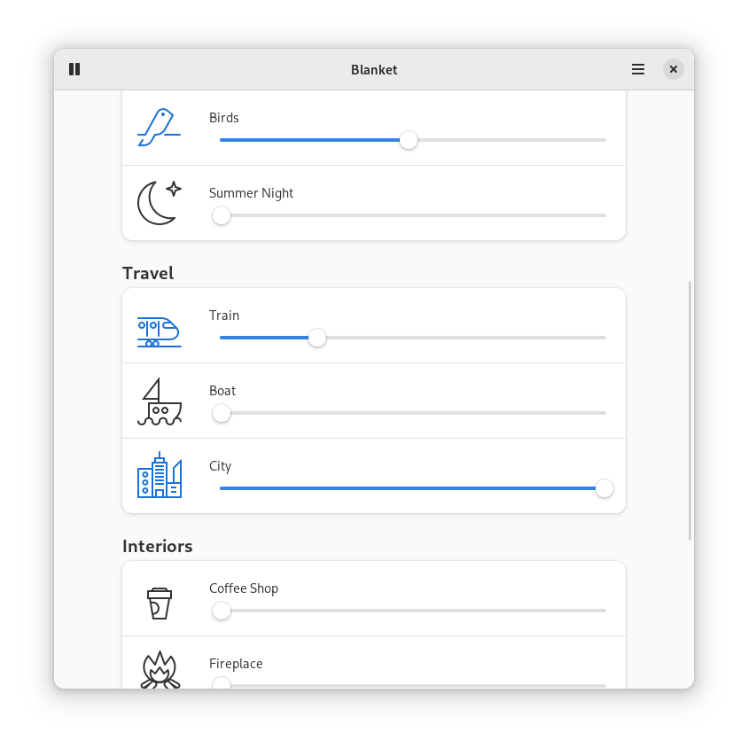

# Loro

**An application for learning German language**

<br>


<p align="center">
  
</p>

## Description
The main goal of this application is to learn the German language by
analyzing documents.

This documents can be:
- Invoices
- School letters
- Ads
- Instant Messaging services(eg. Whatsapp, Telegram groups)

## How

By creating text files with the format {topic}-{subtopic}_{sequence}.txt
and writing only one sentence per line.

In this way, Loro can scan these files, and thanks to libraries like
'SpaCy', analyze the sentences and extract all the information

## Install

<a href="https://flathub.org/apps/details/com.github.t00m.Loro"></a>

### Third Party Packages

### Build from source

#### Minimum requirements

- Python 3 `python`
- PyGObject `python-gobject`
- Gtk 4.8.3
- Adw 1.2.2
- Meson `meson`
- Ninja `ninja`

Alternatively, use the following commands to build it with meson.
```bash
meson builddir --prefix=/usr/local
sudo ninja -C builddir install
```

## Translations
Loro is translated into several languages. If your language is missing or incomplete, please help to [translate Loro in Weblate](https://hosted.weblate.org/engage/loro/).

<a href="https://hosted.weblate.org/engage/loro/">

</a>

## Credits
Developed by **[Tomás Vírseda](https://github.com/t00m)** and [contributors](https://github.com/t00m/Loro/graphs/contributors).

## Donate
If you want to support my work, you can donate me.
